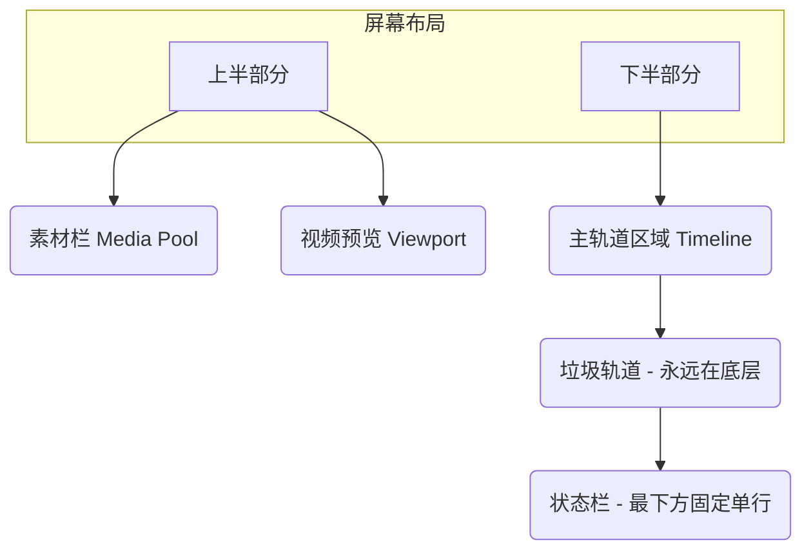

# 项目主界面

这是用户进行剪辑的核心操作台。

## 布局概览
- **左上部分**：素材栏（Media Pool），显示当前项目导入的文件列表。
- **右上部分**：视频预览视口（Viewport）。
- **底部区域**：多轨道时间线（Timeline），默认两条主轨道。
- **最底部固定**：垃圾轨道（Trash Track）。
- **最下方单行**：状态栏（Status Bar）。

## 技术实现要点
- 面板的分割建议使用 `egui_tiles` 或原生的 `egui::SidePanel` + `egui::TopBottomPanel` + `egui::CentralPanel` 组合。
- 视频预览区域并非依靠 CPU 将每一帧传给 egui，而是直接渲染在一个 `wgpu::Texture` 上，egui 中只放置一个分配好 TextureId 的 `Image` 控件。
- 轨道区是自定义绘制区域，利用 `egui::Painter` 进行实时画图，确保时间线能以 60 FPS 平滑滚动缩放。
