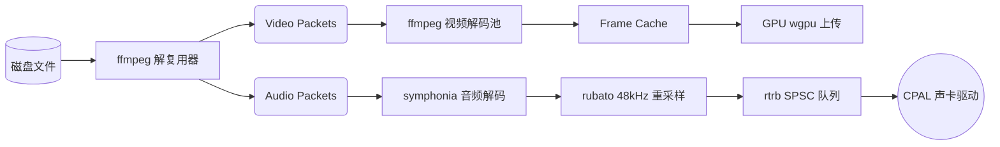

# 媒体处理子系统

媒体处理模块负责视频和音频的解封装、解码、重采样以及波形和缓存生成。

```mermaid
graph LR
    Disk[(磁盘文件)] --> Demuxer[ffmpeg 解复用器]
    Demuxer --> VideoQ(Video Packets)
    Demuxer --> AudioQ(Audio Packets)

    VideoQ --> VideoDec[ffmpeg 视频解码池]
    VideoDec --> FrameBuf[Frame Cache]
    FrameBuf --> Render[GPU wgpu 上传]

    AudioQ --> AudioDec[symphonia 音频解码]
    AudioDec --> Resampler[rubato 48kHz 重采样]
    Resampler --> RingBuf[rtrb SPSC 队列]
    RingBuf --> CPAL((CPAL 声卡驱动))
```
