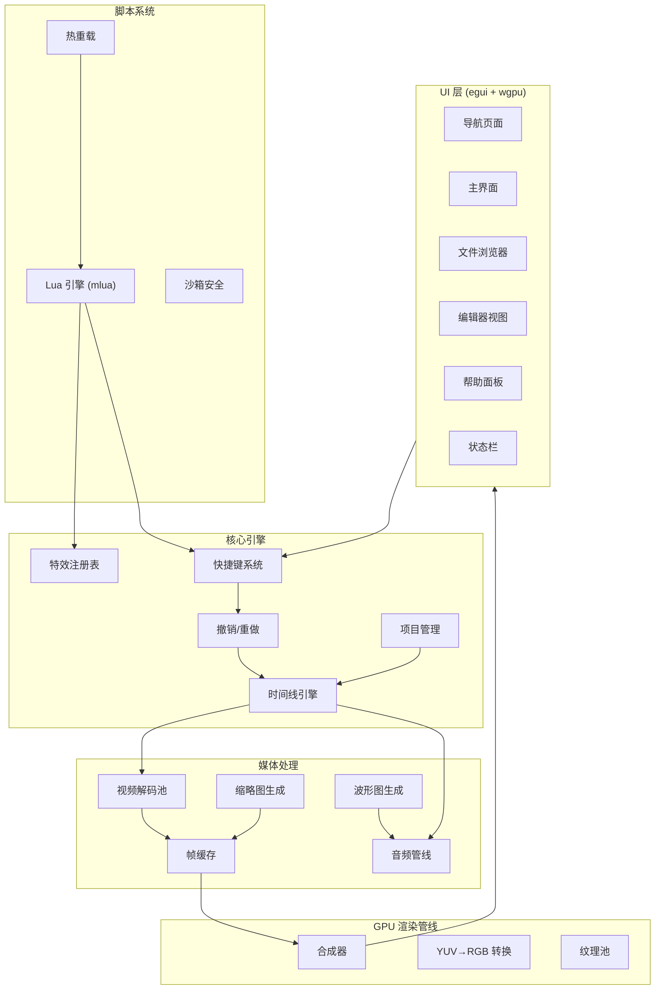
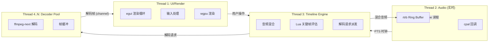

# VideoCut - 架构设计文档

> 无鼠标操作的视频剪辑软件，使用 Rust 编写，支持 vim-like 快捷键，使用 Lua 脚本添加效果。

## 目录

- [项目概述](#项目概述)
- [技术栈](#技术栈)
- [系统架构](#系统架构)
- [线程模型](#线程模型)
- [模块文档索引](#模块文档索引)
- [附录](#附录)

---

## 项目概述

VideoCut 是一款面向键盘操作的非线性视频编辑器（NLE），核心设计理念：

- **纯键盘操作**：所有操作均可通过 vim-like 快捷键完成
- **Lua 脚本扩展**：通过 Lua 脚本绑定快捷键、添加特效、自定义命令
- **非破坏性编辑**：源媒体文件只读，所有编辑操作以指令形式存储
- **注册式架构**：特效、属性、命令均通过注册机制添加，保证可扩展性
- **仅支持 Unix-like 系统**

---

## 技术栈

### 核心依赖

| 类别 | Crate | 版本 | 用途 |
|------|-------|------|------|
| **GUI 框架** | `egui` / `eframe` | v0.36.x | 即时模式 GUI 框架 |
| **GPU 渲染** | `wgpu` | v30.0 | 跨平台 GPU 渲染（Metal/Vulkan） |
| **视频编解码** | `ffmpeg-next` | v9.0.0 | FFmpeg 绑定，解码/编码/硬件加速 |
| **音频 I/O** | `cpal` | v0.18.1 | 跨平台音频设备驱动 |
| **音频解码** | `symphonia` | v0.6.0 | 纯 Rust 音频解码（MP3/FLAC/WAV/AAC） |
| **音频重采样** | `rubato` | v5.0.0 | 高质量 Sinc 重采样 |
| **音频 Ring Buffer** | `rtrb` | v0.3.1 | Lock-free SPSC ring buffer |
| **图像处理** | `fast_image_resize` | v6.1.0 | SIMD 加速图像缩放 |
| **图像 I/O** | `image` | v0.25.10 | 图像读写（PNG/JPEG/WebP） |
| **Lua 脚本** | `mlua` | v0.12.0 | Lua 5.4/LuaJIT 绑定 |
| **文本缓冲** | `ropey` | v1.6.1 | Rope 数据结构（高效文本编辑） |
| **语法高亮** | `tree-sitter` | v0.24.x | 增量语法解析 |
| **Lua 语法** | `tree-sitter-lua` | v0.5.0 | Lua 语法树 |
| **中文拼音** | `pinyin` | v0.11.0 | 汉字转拼音 |
| **模糊搜索** | `nucleo` | v0.5.0 | 高性能模糊匹配 |
| **文件监控** | `notify` | v8.0.0 | 文件系统变更通知 |
| **目录遍历** | `walkdir` | v2.5.0 | 递归目录遍历 |
| **系统目录** | `dirs` | v6.0.0 | 标准系统路径 |
| **序列化** | `serde` + `serde_json` | v1.0 | JSON 序列化 |
| **二进制缓存** | `rmp-serde` | v1.3.1 | MessagePack 序列化 |
| **帧缓存** | `moka` | v0.12 | 高性能 LRU 缓存 |
| **并发通道** | `crossbeam-channel` | latest | 多生产者多消费者通道 |
| **时间索引** | `intervaltree` | latest | 区间树查询 |
| **错误处理** | `thiserror` + `anyhow` | latest | 错误定义与传播 |

---

## 系统架构

### 整体架构图

### 核心设计原则

1. **混合架构**：UI 层使用即时模式（egui），引擎核心使用数据驱动
2. **非阻塞通信**：模块间通过 `crossbeam-channel` 异步通信
3. **音频主时钟**：音频硬件回调驱动播放时钟，视频同步到音频
4. **Command Pattern**：所有编辑操作封装为命令，支持撤销/重做
5. **注册式扩展**：特效、属性、命令均通过注册表添加

---

## 线程模型

### 线程职责

| 线程 | 优先级 | 职责 | 关键约束 |
|------|--------|------|----------|
| UI/Render | 普通 | egui 渲染、输入处理、GPU 纹理上传 | 不允许阻塞 I/O |
| Audio | 实时 | cpal 硬件回调、音频采样输出 | Lock-free，禁止分配内存 |
| Timeline | 普通 | 混音、Lua 评估、派发解码请求 | — |
| Decoder Pool | 普通 | FFmpeg 解码、帧格式转换 | bounded channel 防内存溢出 |

---

## 模块文档索引

### 界面与交互

| 模块 | 路径 | 描述 |
|------|------|------|
| GUI 框架 | [01-gui/](./01-gui/README.md) | egui + wgpu 界面系统总述 |
| ├─ 导航页面 | [01-gui/01-navigation/](./01-gui/01-navigation/README.md) | 项目选择、搜索、新建 |
| ├─ 主界面 | [01-gui/02-main-interface/](./01-gui/02-main-interface/README.md) | 素材栏、预览、轨道布局 |
| ├─ 文件浏览器 | [01-gui/03-file-browser/](./01-gui/03-file-browser/README.md) | 三列文件导入/导出 |
| ├─ 编辑器 | [01-gui/04-editor/](./01-gui/04-editor/README.md) | Lua 编辑器 + 预览 |
| ├─ 帮助面板 | [01-gui/05-help-panel/](./01-gui/05-help-panel/README.md) | 快捷键帮助悬浮面板 |
| └─ 状态栏 | [01-gui/06-status-bar/](./01-gui/06-status-bar/README.md) | 底部命令/状态展示 |

### 时间线系统

| 模块 | 路径 | 描述 |
|------|------|------|
| 时间线 | [02-timeline/](./02-timeline/README.md) | 时间线数据结构与核心操作 |
| ├─ 轨道 | [02-timeline/01-track/](./02-timeline/01-track/README.md) | 轨道管理、置顶、排序 |
| ├─ 切片 | [02-timeline/02-clip/](./02-timeline/02-clip/README.md) | 切片属性、分割、合并 |
| ├─ 锚点 | [02-timeline/03-anchor/](./02-timeline/03-anchor/README.md) | 标记点系统 |
| ├─ 选择 | [02-timeline/04-selection/](./02-timeline/04-selection/README.md) | v/V 选择模式、bisect |
| └─ 垃圾轨道 | [02-timeline/05-trash-track/](./02-timeline/05-trash-track/README.md) | 已删除切片暂存 |

### 媒体处理

| 模块 | 路径 | 描述 |
|------|------|------|
| 媒体处理 | [03-media/](./03-media/README.md) | 多线程解码管线 |
| ├─ 视频解码 | [03-media/01-video-decode/](./03-media/01-video-decode/README.md) | FFmpeg 解码、帧精确定位 |
| ├─ 音频处理 | [03-media/02-audio/](./03-media/02-audio/README.md) | 音频播放、主时钟、重采样 |
| ├─ 缩略图 | [03-media/03-thumbnail/](./03-media/03-thumbnail/README.md) | SIMD 加速缩略图生成 |
| ├─ 波形图 | [03-media/04-waveform/](./03-media/04-waveform/README.md) | 多分辨率波形数据 |
| ├─ 帧缓存 | [03-media/05-frame-cache/](./03-media/05-frame-cache/README.md) | 三级缓存策略 |
| ├─ 代理媒体 | [03-media/06-proxy-media/](./03-media/06-proxy-media/README.md) | 低清代理、离线粗剪 |
| └─ 音频 EQ / Loudness | [03-media/07-audio-eq/](./03-media/07-audio-eq/README.md) | 三段 EQ、EBU R128 标准化 |

### 快捷键系统

| 模块 | 路径 | 描述 |
|------|------|------|
| 快捷键 | [04-keybinding/](./04-keybinding/README.md) | 模态编辑、Trie 树 |
| ├─ 模态系统 | [04-keybinding/01-modal-system/](./04-keybinding/01-modal-system/README.md) | Normal/Visual/Command 等模式 |
| ├─ 按键 Trie | [04-keybinding/02-key-trie/](./04-keybinding/02-key-trie/README.md) | 按键序列解析 |
| ├─ 命令模式 | [04-keybinding/03-command-mode/](./04-keybinding/03-command-mode/README.md) | 冒号命令系统 |
| ├─ 键盘宏持久化 | [04-keybinding/04-macro-persistence/](./04-keybinding/04-macro-persistence/README.md) | JSON/Lua 宏存档 |
| └─ 键位预设 / 冲突检测 | [04-keybinding/05-keymap-profiles/](./04-keybinding/05-keymap-profiles/README.md) | Vim/PR/FCP 预设与导入导出 |

### 特效与属性

| 模块 | 路径 | 描述 |
|------|------|------|
| 特效系统 | [05-effects/](./05-effects/README.md) | 注册式特效/属性框架 |
| ├─ 注册机制 | [05-effects/01-registry/](./05-effects/01-registry/README.md) | 工厂模式 + inventory |
| ├─ 动画 | [05-effects/02-animation/](./05-effects/02-animation/README.md) | 关键帧动画系统 |
| ├─ 摄像机 | [05-effects/03-camera/](./05-effects/03-camera/README.md) | 视口聚焦控制 |
| ├─ 变换 | [05-effects/04-transform/](./05-effects/04-transform/README.md) | 缩放/旋转/移动 |
| ├─ 遮罩 | [05-effects/05-mask/](./05-effects/05-mask/README.md) | 颜色透明处理 |
| ├─ 变速 | [05-effects/06-speed/](./05-effects/06-speed/README.md) | 加速/减速 |
| ├─ 跟随 | [05-effects/07-follow/](./05-effects/07-follow/README.md) | 切片跟随 |
| ├─ 锁定 | [05-effects/08-lock/](./05-effects/08-lock/README.md) | 位置锁定 |
| └─ Z 轴 | [05-effects/09-zindex/](./05-effects/09-zindex/README.md) | 层级排序 |

### Lua 脚本

| 模块 | 路径 | 描述 |
|------|------|------|
| Lua 脚本 | [06-lua/](./06-lua/README.md) | mlua 脚本引擎 |
| ├─ API 设计 | [06-lua/01-api-design/](./06-lua/01-api-design/README.md) | Rust→Lua API 接口 |
| ├─ 沙箱 | [06-lua/02-sandbox/](./06-lua/02-sandbox/README.md) | 安全限制 |
| └─ 热重载 | [06-lua/03-hot-reload/](./06-lua/03-hot-reload/README.md) | 文件变更自动加载 |

### 内置编辑器

| 模块 | 路径 | 描述 |
|------|------|------|
| 编辑器 | [07-editor-view/](./07-editor-view/README.md) | vim-like Lua 编辑器 |
| ├─ 文本缓冲 | [07-editor-view/01-text-buffer/](./07-editor-view/01-text-buffer/README.md) | ropey Rope 结构 |
| ├─ 语法高亮 | [07-editor-view/02-syntax/](./07-editor-view/02-syntax/README.md) | tree-sitter 增量解析 |
| └─ 补全 | [07-editor-view/03-completion/](./07-editor-view/03-completion/README.md) | AST + 运行时补全 |

### 搜索系统

| 模块 | 路径 | 描述 |
|------|------|------|
| 搜索 | [08-search/](./08-search/README.md) | 拼音 + 模糊搜索 |
| ├─ 拼音匹配 | [08-search/01-pinyin/](./08-search/01-pinyin/README.md) | 汉字→拼音索引 |
| └─ 模糊搜索 | [08-search/02-fuzzy/](./08-search/02-fuzzy/README.md) | nucleo 匹配引擎 |

### 项目管理

| 模块 | 路径 | 描述 |
|------|------|------|
| 项目 | [09-project/](./09-project/README.md) | 项目持久化 |
| ├─ 文件格式 | [09-project/01-file-format/](./09-project/01-file-format/README.md) | JSON 项目文件 (.vcut) |
| ├─ 自动保存 | [09-project/02-auto-save/](./09-project/02-auto-save/README.md) | 原子写入 + WAL |
| └─ 撤销重做 | [09-project/03-undo-redo/](./09-project/03-undo-redo/README.md) | Command Pattern |

### GPU 渲染

| 模块 | 路径 | 描述 |
|------|------|------|
| 渲染 | [10-rendering/](./10-rendering/README.md) | wgpu 渲染管线 |
| ├─ 合成器 | [10-rendering/01-compositor/](./10-rendering/01-compositor/README.md) | 多轨道合成 |
| ├─ YUV 转换 | [10-rendering/02-yuv-convert/](./10-rendering/02-yuv-convert/README.md) | GPU 色彩空间转换 |
| └─ 纹理池 | [10-rendering/03-texture-pool/](./10-rendering/03-texture-pool/README.md) | 纹理回收复用 |

---

## 附录

| 文件 | 描述 |
|------|------|
| [stack.md](./stack.md) | 任务栈（当前开发进度） |
| [glossary.md](./glossary.md) | 术语表 |
| [CODING_GUIDE.md](../CODING_GUIDE.md) | AI 编程规范 |
| [PLAN.md](../PLAN.md) | 原始需求文档 |
